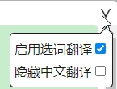

# Anki 划词翻译助手

  

## 该插件有什么用？

更轻松的英语翻译

- 热键翻译：鼠标移动到希望进行翻译的单词上，按下热键（默认:`Shift`）进行翻译
- 拖蓝翻译：拖动鼠标，其中被拖蓝选中的英语会被翻译
- 搜索框输入翻译：按下`Alt+W`（默认）,在弹出的输入框中输入需要翻译的内容进行翻译

更轻松的将翻译相关数据添加到[Anki]进行复习

- 点击翻译框上的添加按钮便可将卡片添加到[Anki]进行复习

## 三种翻译方式的区别

| 区别       |     热键翻译      |        拖蓝翻译         |      搜索框翻译       |
| :--------- | :---------------: | :---------------------: | :-------------------: |
| 支持的内容 |       单词        |     单词/短语/句子      | 单词/短语/句子/中译英 |
| 易用性     | 移动鼠标,按下热键 | 双击鼠标/按住鼠标后拖动 |    唤出输入框输入     |

> 特别的，为了使 热键翻译 功能不被不可选中状态影响，按下选词热键可以破除文本的不可选取状态。这意味着，如果用户遇到了`希望复制某段文本，但该文本需要登陆后才可以复制`的情况时，可以将鼠标移动到该文本上方并按下选词热键破除文本不可选中的状态，之后便可对文本进行拖蓝复制。同样的，如果某段文本不能够被拖蓝选中（也即此时拖蓝翻译不可用），也可以按下选词热键破除文本的不可选中状态。

> 选词热键破除文本不可选中状态是对所浏览的文档的相关元素样式（user-select）进行修改，该修改是可逆的，如果有需要，可以开关一次该插件，以恢复这种修改。
## 标签栏
  

> ...：点击后打开配置页，进行更多相关配置

> 开关插件：关闭/开启热键翻译及拖蓝翻译功能（搜索框翻译依然可用）

> 划词增强：一般情况下，为了避免插件影响用户输入，在焦点处于可编辑区域（例如：输入框）时，热键翻译及拖蓝翻译会被停用。而该功能的效果是，在按住`Ctrl`键时，拖蓝选中可编辑区域中的文本时会对其进行翻译。

> 取词热键：热键翻译功能用于选中单词的热键（`Shift`、`Ctrl`、`Alt`）

## 翻译展示窗口

  

该窗口会在有翻译数据需要展现是显示，也可以通过`Alt+R`（默认）快捷键主动唤出。

> 左上角的`< >`,是两个历史记录按钮，用于查看历史记录。

> 右上角的 `V` 是配置按钮,点击后展开两项相关配置

> 

- 启用选词翻译：在翻译展示窗口内启用拖蓝翻译功能，此时对翻译展示窗口内的英文选中后会对其进行翻译。其翻译内容也会展示在翻译展示窗口内，也即之前的翻译会被覆盖，可以通过历史记录按钮回退到之前的翻译内容。

- 隐藏中文翻译：可能你更希望用英文解释英文，此时中文翻译可能是一种妨碍，你可以通过选中该项来隐藏中文翻译。此时效果如图：

> 🔉：播放音频

> +：将该单词相关数据添加到 Anki，以做成相关卡片进行复习

## 配置页面

插件与 Anki 之间的连接依赖于名为 [AnkiConnect] 的 Anki 插件，`连接URL`所对应的便是 AnkiConnect 插件配置的相应URL。插件本身默认的URL与 AnkiConnect 默认暴露的URL是一致的，除非用户有额外的需求需要调整，否则是无需调整的

> 重置按钮：将`连接URL`恢复为默认值

> 刷新按钮：用于刷新与 AnkiConnect 之间的连接状态

> 保存按钮：对配置进行保存

> 退出按钮：退出配置页，与直接点击右上角的 `X` 不同的是，使用该按钮退出时如果有未保存的配置会得到是否保存的提醒

其它配置页用于将插件提供的单词/短语/句子等数据对应到 Anki 的 NoteType 上，用户只需为自身所需要的数据选择对应的 Field 即可。

当用户 Anki 上的相关配置发生变化，而这种变化导致插件上的配置不再适用时，该配置页面会进行相关提示（如下图红框标注出的配置差异）。在配置错误没纠正之前，将相关数据添加到 Anki 是不会成功的。

对于重复卡片添加的问题，插件将`如何判断卡片是否重复`这一决断交给了用户。用户可以通过勾选相关数据旁边的方框来决定是否将其用于进行重复判断。在上图配置，判断卡片重复是根据 `牌组名称、定义、翻译、单词`四项作为标准。

其作用机理为：生成一段类似`deck:xxxx 定义:xxxx 单词:xxxx 翻译:xxxx`的字符串到 Anki 的 Browse 内的 search 输入框中进行查询，通过查询到的卡片数量来进行重复判断。

需要注意的是，选中越多判断越严格（命中重复的概率更低，更多类似的卡片被添加），反之则越宽松（命中重复的概率更高，更少类似的卡片被添加），推荐使用默认配置。

## 快捷键

有哪些快捷键？
- `Alt+W` 打开搜索翻译框
- `Alt+R` 显示翻译展示框
- `Alt+Q` 开关插件（等同于标签栏中的`开关插件`按钮）
- `Shift` 热键翻译的热键

如何修改这些快捷键？
- 对于`Alt+W/R/Q`，在浏览器拓展程序的键盘快捷键页面中进行修改。以chrome为例，也即打开 `chrome://extensions/shortcuts` 页面进行修改，其它浏览器类似。
- 对于热键翻译功能的热键，在标签栏中的`取词热键`中进行修改，可从`Shift、Ctrl、Alt`中选择其中之一

## 常见问题

`翻译展示窗口`的历史记录容量是多少？
> 10

如果我频繁对同一个单词进行翻译，会发送多次网络请求吗？
> 不会，对于翻译查询的结果会进行缓存（容量为30），也就是说一个翻译只要在最近30次之内有过查询，便会被复用，而不发出网络请求。

[anki]: https://apps.ankiweb.net
[ankiconnect]: https://ankiweb.net/shared/info/2055492159
